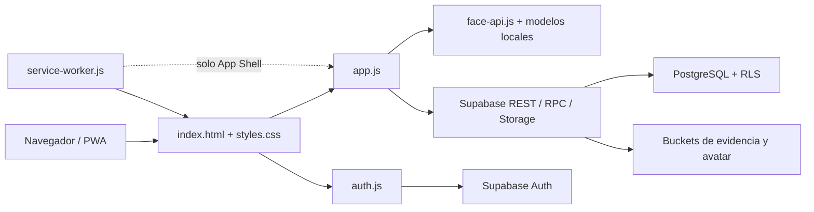

# Arquitectura actual

Actualizado: 2026-07-15.

Este documento describe el sistema que existe en el repositorio. No sustituye la
verificacion del esquema remoto de Supabase ni afirma que toda migracion local ya
este aplicada.

## Vista general

La aplicacion es una SPA estatica sin framework ni proceso de compilacion. La
interfaz y gran parte de la orquestacion viven en `app.js`; las decisiones finales
de autorizacion y asistencia deben resolverse en Supabase mediante RLS y RPC.

## Componentes

### Cliente

- `index.html`: contiene las vistas de login, inicio, entrada, salida, registros,
  perfil y backoffice.
- `styles.css`: tokens, componentes, layouts de escritorio y movil.
- `app.js`: estado de la SPA, navegacion, formularios, camara, GPS, rostro,
  asistencia, panel administrativo y acceso a Supabase.
- `auth.js`: llamadas de Supabase Auth, persistencia de sesion y renovacion.
- `notification-rules.js`: calculo de recordatorios locales.
- `supabase-config.js`: configuracion publica del cliente.

### PWA

- `manifest.webmanifest`: identidad, iconos y modo de instalacion.
- `service-worker.js`: cachea solo archivos estaticos del mismo origen.
- La aplicacion no debe registrar asistencia offline ni guardar evidencias para
  sincronizarlas despues.

### Reconocimiento facial

- `face-api.js` se consume desde el cliente.
- `models/` contiene Tiny Face Detector, landmarks y reconocimiento facial.
- La regla operativa actual exige exactamente un rostro en la captura.
- La comparacion facial es una evidencia auxiliar y no reemplaza la identidad
  autenticada ni la revision humana.

### Backend Supabase

- Auth administra las cuentas y sesiones.
- PostgreSQL almacena usuarios de aplicacion, organizaciones, sitios, asistencias,
  configuracion y auditoria.
- RPC concentra operaciones sensibles como entrada, salida, asignacion de alcance
  y administracion de usuarios.
- RLS limita lectura y escritura por identidad, rol, organizacion y sitio.
- Storage conserva fotos de asistencia y avatares.

## Entidades principales observadas

| Entidad | Responsabilidad |
| --- | --- |
| `organizaciones` | Empresa, escuela o institucion propietaria de sitios. |
| `sitios` | Ubicacion operativa, horarios, GPS y configuracion de asistencia. |
| `usuarios_app` | Perfil autenticado, rol, organizacion, sitio principal y estado. |
| `usuarios` | Catalogo heredado usado por compatibilidad en algunos flujos. |
| `usuario_sitios_alcance` | Sitios adicionales que un supervisor o rol autorizado puede vigilar. |
| `asistencias` | Jornada, entrada, salida, evidencia, GPS, riesgo y estado. |
| `audit_logs` | Acciones sensibles y resultados operativos. |
| `site_admin_invites` | Invitaciones o claves temporales asociadas a un alcance. |
| `system_owners` | Capacidad especial para proteger el ciclo de vida de superadmins. |
| Sesiones operativas | Control de sesion activa por dispositivo mediante RPC. |

Los nombres y columnas definitivos deben consultarse en el esquema remoto y en
las migraciones realmente aplicadas.

## Roles y alcance

La autorizacion combina **rol** y **alcance**. Cambiar el sitio de una persona no
debe cambiar su rol automaticamente.

| Rol | Alcance esperado | Responsabilidad principal |
| --- | --- | --- |
| `usuario` | Propio perfil y sitio asignado | Registrar entrada/salida y ver su historial. |
| `supervisor` | Uno o varios sitios autorizados | Supervisar asistencias, fotos, notas y revision operativa sin acciones destructivas. |
| `admin` | Una organizacion | Administrar sus sitios, usuarios, horarios, asistencia y auditoria organizacional. |
| `superadmin` | Global | Administrar organizaciones, roles y operacion completa. |

`system_owner` no es un rol de interfaz. Es una capacidad backend mas restringida
para proteger superadmins frente a eliminacion o degradacion indebida.

El modo invitado/operativo que todavia aparece en la interfaz no debe otorgar
permisos administrativos ni usarse como autoridad de produccion.

## Flujo de autenticacion

1. El usuario inicia sesion o crea una cuenta con Supabase Auth.
2. La app obtiene el usuario de aplicacion mediante `get_current_app_user`.
3. Se activa la sesion operativa del dispositivo con `activate_app_session`.
4. Se cargan rol, organizacion, sitio principal y alcances adicionales.
5. La interfaz muestra las vistas permitidas, pero el backend vuelve a validar
   cualquier accion sensible.
6. Al cerrar sesion se intenta desactivar la sesion operativa.

La activacion de la sesion debe ocurrir antes de llamar RPC protegidas. Este orden
es critico para evitar bloqueos de login.

## Flujo de entrada

1. La app identifica al usuario autenticado y su sitio operativo.
2. Un admin o superadmin puede elegir un sitio permitido cuando su alcance lo autoriza.
3. Se solicita camara y se valida que exista un solo rostro.
4. Se solicita GPS y se capturan precision y coordenadas.
5. La evidencia se sube a Storage.
6. `registrar_entrada_segura` valida en servidor usuario, sitio, horario,
   duplicidad/ciclo permitido, ubicacion y hora oficial.
7. Se crea la asistencia y se actualiza la interfaz.

## Flujo de salida

1. La app busca una entrada activa del mismo usuario/ciclo.
2. Captura foto y GPS de salida.
3. Compara la evidencia facial con la entrada como apoyo antifraude.
4. `registrar_salida_segura` valida alcance, entrada activa, duplicidad, sitio,
   horario y hora del servidor.
5. Se completa el registro o se marca para revision segun el resultado.

Los roles privilegiados admiten ciclos adicionales cuando las migraciones
correspondientes estan aplicadas. Esa excepcion debe seguir validandose en backend.

## QR

El QR puede abrir o dirigir a la vista de asistencia. No debe:

- elevar roles;
- sustituir la sesion autenticada;
- decidir que una salida es valida;
- omitir GPS, foto, horario o alcance;
- permitir acceso a informacion de otra organizacion.

Puede existir codigo heredado de tokens y ventanas horarias. Antes de modificarlo,
consulta [F0-13](fase0/F0-13-qr-solo-acceso.md) y confirma que no se reactive como
autoridad de negocio.

## Configuracion por sitio

El sitio concentra, entre otros, los siguientes parametros operativos:

- nombre, direccion y estado activo;
- zona horaria;
- hora de entrada y salida;
- coordenadas y radio GPS;
- politica de GPS y evidencia;
- etiqueta del identificador institucional;
- clave o invitacion de afiliacion.

La interfaz puede editar estos datos solo dentro del alcance permitido. RLS/RPC
debe impedir que el cliente cambie directamente una organizacion ajena.

## Estado de capacidades

### Implementadas

- Auth, perfiles, roles y paneles diferenciados.
- Multiempresa y multisitio en interfaz y migraciones.
- Entrada/salida con foto, GPS, servidor y RPC.
- Historial propio y vistas administrativas por alcance.
- Configuracion de sitios, gestion de usuarios y auditoria.
- PWA instalable con cache del App Shell.
- Avatar privado y URL firmada en el flujo reciente de perfil.
- Sesion operativa por dispositivo.

### Parciales o pendientes de verificacion remota

- Aislamiento RLS completo en todas las tablas y RPC heredadas.
- Flujo privado uniforme para toda evidencia de asistencia.
- Eliminacion/reactivacion y proteccion de roles en todos los casos limite.
- Sincronizacion entre `usuarios` heredada y `usuarios_app`.
- Aplicacion ordenada de todas las migraciones locales.
- Notificaciones cuando la PWA esta cerrada.

### Planeadas o desactivadas

- Politicas completas de privacidad, ARCO y retencion automatizada.
- Evidencia documental sensible configurable de extremo a extremo.
- Notificaciones push de servidor.
- Calendarios laborales y dias festivos por organizacion.
- RPC de racha: solo se usa cuando `SUPABASE.enableAttendanceStreakRpc === true`.
